<div align="center">
  
</div>

<div align="center">
  <a href="mailto:andrebragans@gmail.com">
    
  </a>
  <a href="https://github.com/andrebragans?tab=repositories">
    
  </a>
  
</div>

<br />

## Sobre mim

Sou desenvolvedor de software formado em **Ciências da Computação**, de Salvador, Bahia. Gosto de transformar problemas complexos em produtos simples de usar, com atenção especial a APIs, automação e experiências digitais orientadas por dados.

```text
📍 Salvador, BA          ⚡ Backend, IA e Cloud
🎯 Construindo produtos   🌱 Evoluindo todos os dias
```

<details>
  <summary><strong>💡 O que estou explorando agora</strong></summary>
  <br />

- Arquiteturas backend confiáveis com Java e Python
- Aplicações web modernas com TypeScript e Next.js
- Inteligência artificial aplicada a produtos reais
- Infraestrutura, automação e serviços em nuvem

</details>

## Stack

<div align="center">
  
</div>

## Projetos em destaque

| Projeto | O que você encontra | Tecnologias |
| :--- | :--- | :---: |
| [**Fila de Impressão Heap**](https://github.com/andrebragans/FiladeImpressaoHeap) | Implementação de fila de prioridade aplicada a impressões. | `Java` |
| [**XadrezIA**](https://github.com/andrebragans/XadrezIA) | Experimento de xadrez que combina lógica em Java e componentes de IA em Python. | `Java` `Python` |
| [**Teste de Software**](https://github.com/andrebragans/TestedeSoftware) | Práticas da disciplina de Gestão e Qualidade de Software. | `JavaScript` |

<div align="center">
  <a href="https://github.com/andrebragans?tab=repositories">
    
  </a>
</div>

## Atividade no GitHub

<div align="center">
  
</div>

<div align="center">
  
  
</div>

<div align="center">
  
</div>

---

<div align="center">
  <strong>Vamos construir algo interessante?</strong><br />
  <sub>Estou sempre aberto a trocar ideias sobre software, produto e tecnologia.</sub>
</div>
